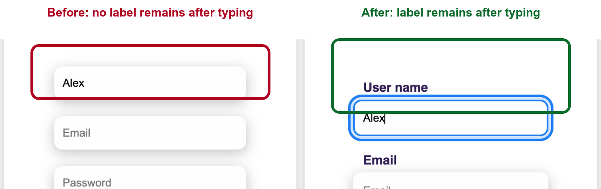

# Deficiency: Auth form fields relied on placeholder-only labels

## Where the flaw came from

The flaw is in `views/signup.ejs`. In the original sign-up and login forms, the
text, email, and password inputs used placeholder text to explain the field, but
there were no persistent visible labels connected with `id` and `for`.

Affected controls:

- `SignUpUsername`
- `SignUpEmail`
- `SignUpPassword`
- `LoginEmail`
- `LoginPassword`

Before the fix, a field looked like this:

```html
<input type="email" name="SignUpEmail" placeholder="Email" required="true" />
```

This is fragile because the label disappears as soon as the user types. It also
leaves the meaning of the field dependent on placeholder behavior instead of a
stable form-label relationship in the markup.

## How the flaw was found

I found this during manual source inspection of `views/signup.ejs`. I checked the
account forms and compared every text, email, and password input with the labels
around it. The form had placeholders, but the user-entered fields did not have
matching `id` attributes and `<label for="...">` elements.

Chrome DevTools MCP was then used to reproduce the usability issue in the
browser. In the original page, typing `Alex` into the username field removed the
placeholder and left no visible field label. That browser evidence is captured in
`docs/pr1/evidence/signup-labels-before-after.png`.

## Literature review

The fix follows W3C WAI guidance on form labels. W3C explains that labels should
identify the purpose of a form control and should be programmatically associated
with the related input. For ordinary text inputs, the direct implementation is a
unique input `id` plus a visible `<label>` whose `for` value points to that same
`id`.

WebAIM's accessible forms guidance supports the same approach from a practical
usability perspective: placeholder text can help as an example, but it should not
replace a real label because it disappears during input and can make review or
correction harder.

Report-ready references in IEEE style:

[1] W3C Web Accessibility Initiative, "Labeling Controls," Forms Tutorial.
[Online]. Available: https://www.w3.org/WAI/tutorials/forms/labels/ Accessed:
May 8, 2026.

[2] WebAIM, "Creating Accessible Forms - Advanced Form Labeling." [Online].
Available: https://webaim.org/techniques/forms/advanced Accessed: May 8, 2026.

[3] W3C Web Accessibility Initiative, "Understanding Success Criterion 3.3.2:
Labels or Instructions." [Online]. Available:
https://www.w3.org/WAI/WCAG22/Understanding/labels-or-instructions.html
Accessed: May 8, 2026.

## Implementation rationale

The implementation keeps the original sign-up/login card, but changes the form
markup so each account input has a persistent label and a stable machine-readable
relationship.

Before:

```html
<input type="email" name="SignUpEmail" placeholder="Email" required="true" />
```

After:

```html
<label class="field-label" for="signup-email">Email</label>
<input
  id="signup-email"
  type="email"
  name="SignUpEmail"
  autocomplete="email"
  placeholder="Email"
  required
/>
```

The research led directly to three code decisions:

- Add visible `.field-label` labels instead of relying on placeholders.
- Add matching `id` and `for` values so each label is associated with its input.
- Keep placeholders only as secondary examples, and add `autocomplete` values for
  smoother account-form completion.

The CSS in `static/styles/signup.css` was adjusted so the large Sign up/Login
panel labels use `.toggle-label`, while normal form labels use `.field-label`.
This avoids applying the oversized panel-title style to every input label.

## Before and after evidence



Figure 1: Before the fix, typing into the username field removes the placeholder
and leaves no visible label. After the fix, the explicit "User name" label stays
visible while the user types.

Chrome DevTools MCP also showed the fixed page exposing labeled fields in the
accessibility tree, including `textbox "User name"`, `textbox "Email"`, and
`textbox "Password"` for the sign-up form, plus labeled email and password
fields for the login form.

## Verification

- Opened the original and fixed `/signup` page states with Chrome DevTools MCP.
- Captured the before/after evidence image in `docs/pr1/evidence/`.
- Confirmed the fixed page exposes named textboxes in the browser accessibility
  snapshot.
